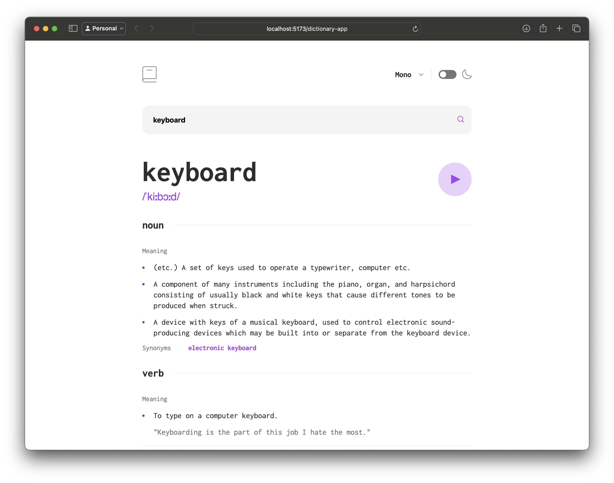

# FrontendMentor Dictionary App Project



A web application that allows you to search for the meaning of words. It only works in English, and uses the API from https://dictionaryapi.dev to find meanings of words.

This app was built using TypeScript, Vite, and React.js.

Reference links:
* Frontendmentor exercise page: https://www.frontendmentor.io/solutions/dictionary-app-U99fXOp180
* Live site: https://ghoulkingr.github.io/dictionary-app/

# Running this project locally

To run this project on your system, run these commands in your terminal:
```bash
# clone this project
git cone https://github.com/GhoulKingR/dictionary-app.git

# open the project in the terminal
cd dictionary-app

# install dependencies
npm i

# run the development server
npm run dev
```
